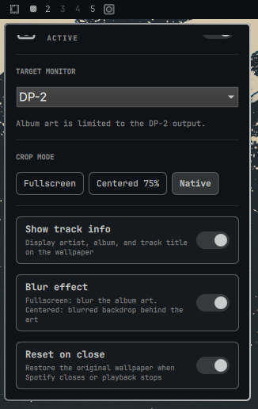

# Spotify Album Wallpaper — Multi-Monitor Fork

This is a multi-monitor-focused fork of Emil Sall's original
[Omarchy Spotify Wallpaper](https://github.com/emilsall/omarchy-spotify-wallpaper)
plugin. It preserves the original plugin's design while adding selectable
Hyprland output targeting for multi-monitor Omarchy setups and a configurable
bar section for the plugin icon. These fork-specific
changes are maintained independently and are not affiliated with or supported
by the original author.

Shows the currently playing Spotify album art on the monitor you choose while
leaving Omarchy's normal theme wallpaper visible everywhere else. The album-art
layer is removed when playback stops or Spotify closes.

Works with both the official Spotify client and
[Omarchy Spotify](https://github.com/stappmus/Omarchy-Spotify) — any MPRIS
player with "spotify" in its name is detected automatically.

## Features

- Album art becomes the desktop wallpaper while music plays
- Icon placement can be switched between the left, centre, and right Omarchy
  bar sections; existing installations remain on the left by default
- Multi-monitor targeting from the settings panel:
  - **Auto** resolves to the focused monitor whenever album art is generated
    and keeps that resolved output stable until the next wallpaper update
  - **All** displays album art on every connected monitor
  - **Named output** (for example, `DP-1` or `DP-2`) pins album art to that
    specific Hyprland output while other monitors retain the Omarchy wallpaper
- Three crop modes: **Fullscreen**, **Centered** (default), **Native** resolution
- Proportional artwork uses 10–100% of the output’s shorter dimension (75% by default), with rotation-aware rendering for portrait displays
- Optional blur effect — blurs the fullscreen art, or uses a blurred backdrop behind the art in centered modes
- Optional track info overlay (artist – album – title) rendered in the current
  theme's colors — pill-style card on fullscreen, below the art on centered modes
- Re-renders automatically on theme switches so colors always match
- Restores your theme wallpaper on pause, stop, or app close (toggleable)
- Settings panel in the Omarchy bar with native panel UI

## Screenshots
### Multi-monitor targeting
Select `auto`, every connected output, or pin album art to a specific Hyprland
output such as `DP-2`.



### Appearance


## Requirements

- Omarchy (Quattro shell)
- Hyprland (provided by Omarchy)
- `playerctl`, `jq`, `imagemagick`, `curl`

## Fresh install

```sh
omarchy pkg add playerctl jq imagemagick curl &&
omarchy plugin add https://github.com/c8h10n4o2-b/omarchy-spotify-wallpaper.git --enable
```

Omarchy clones and validates the plugin, enables its bar widget, and stores it
at `~/.config/omarchy/plugins/emilsall.spotify-wallpaper`. The retained plugin
ID provides compatibility with the original plugin.

When the widget first loads, it runs the bundled installer if the user service
is missing. The installer verifies dependencies, enables
`omarchy-spotify-wallpaper.service`, and installs the Omarchy `theme-set` hook.
If setup cannot finish, the panel reports the error and offers a retry button.

Manual setup or repair:

```sh
~/.config/omarchy/plugins/emilsall.spotify-wallpaper/install.sh
```

## Upgrade

Update a normal Git-managed installation with:

```sh
omarchy plugin update emilsall.spotify-wallpaper --yes &&
~/.config/omarchy/plugins/emilsall.spotify-wallpaper/install.sh &&
omarchy restart shell
```

If the original upstream plugin is already installed, it has the same plugin
ID and cannot coexist with this fork. Remove the original installation first,
then perform the fresh install above. Settings stored on the existing bar entry
use compatible keys. The new `targetMonitor` setting defaults to `auto`, and
`barSection` defaults to `left` to preserve the original icon placement.

## Spotify Connect playback

Local Spotify playback works through MPRIS as before. For remote Spotify
Connect playback tracked by Omarchy Spotify, the wallpaper service can read
`quickshell.spotify.player snapshot` over Omarchy shell IPC. This returns only
playing status, title, artist, album, and artwork URL; it does not transfer
playback or access credentials.

Omarchy Spotify 1.0.2 needs the included companion patch to provide this
endpoint. Apply it to the user-installed plugin:

```sh
git -C ~/.config/omarchy/plugins/quickshell.spotify apply --check \
  ~/.config/omarchy/plugins/emilsall.spotify-wallpaper/patches/omarchy-spotify-playback-snapshot.patch &&
git -C ~/.config/omarchy/plugins/quickshell.spotify apply \
  ~/.config/omarchy/plugins/emilsall.spotify-wallpaper/patches/omarchy-spotify-playback-snapshot.patch &&
omarchy restart shell
```

Apply once. If the check fails, inspect the installed version or whether the
endpoint already exists before proceeding. This is a local companion-plugin
change that may need merging on a later explicit plugin update. It is not an
upstream Omarchy Spotify feature requirement for local MPRIS playback.

Open Omarchy Spotify after a new shell session so it discovers remote playback.
Updates follow its existing refresh cadence, plus the wallpaper polling and
rendering delay. If the endpoint is absent, local MPRIS remains available.

## Usage

Click the disc-album icon in the bar to open the settings panel. Right-click
the icon to quickly toggle the plugin on/off.

| Setting | Description |
|---------|-------------|
| Enabled | Master on/off. Turning it off removes the album-art layer and reveals the normal Omarchy wallpaper. |
| Bar placement | Moves the icon to the left, centre, or right section of the Omarchy bar. Left is the default for backward compatibility. |
| Target monitor | The dropdown lists `auto`, `all`, and every currently connected Hyprland output. `auto` resolves to the focused monitor whenever album art is generated; `all` displays it on every monitor; choosing a named output such as `DP-1` or `DP-2` pins it there while other monitors retain their normal Omarchy wallpaper. If a pinned output is unavailable, the next update falls back to the focused output without overwriting the saved selection. |
| Crop mode | Fullscreen (center-crop fill), Centered (10–100% of shortest screen dimension), or Native (original art size) — centered modes letterbox on the theme background color. |
| Show track info | Overlay artist, album, and track title using theme colors and the current Omarchy font. |
| Reset on close | Remove the album-art layer when Spotify closes or playback stops. When off, the last album art remains visible. |
| Blur effect | Fullscreen: blur the album art itself. Centered modes: use a blurred, screen-filling copy of the art (dimmed with 30% black) as the backdrop instead of the theme background color. |

In **Centered** mode, use the **Artwork size** slider to choose 10–100% of
the screen’s shorter side. The percentage is saved when you release the slider,
so dragging does not repeatedly render large images. Native and Fullscreen
keep their existing behavior. The default is 75%.

New installations default to **Centered**. Existing saved crop settings are
preserved; select **Centered** in the panel to opt in. At the default 75%, a 2160×3840 portrait
output uses artwork up to 1620×1620 pixels; a 1920×1080 output uses up to
810×810 pixels. The proportions remain consistent across resolutions.

Monitor names come directly from `hyprctl monitors -j`. Open the panel again
after connecting or disconnecting a display to refresh the dropdown.

Removing the widget from the bar (or running `omarchy plugin disable`) disables
both the bar widget and the plugin-owned background layer. The systemd polling
service remains installed but treats the missing bar entry as disabled.

## Troubleshooting

### The widget does not appear

Confirm that Omarchy discovered and enabled it:

```sh
omarchy plugin list | grep emilsall.spotify-wallpaper
omarchy plugin enable emilsall.spotify-wallpaper --section left
omarchy restart shell
```

### The widget appears but album art does not

Check the dependencies and user service:

```sh
command -v playerctl jq magick curl
systemctl --user status omarchy-spotify-wallpaper.service --no-pager
journalctl --user -u omarchy-spotify-wallpaper.service -n 100 --no-pager
```

Run the manual installer again if the service is missing.

### A monitor is missing from the dropdown

Verify that Hyprland sees it, then close and reopen the settings panel:

```sh
hyprctl monitors all
```

## Uninstall

```sh
cd ~/.config/omarchy/plugins/emilsall.spotify-wallpaper
./uninstall.sh
omarchy plugin remove emilsall.spotify-wallpaper
```

The uninstall script removes the album-art layer, stops and removes the systemd
user service, removes the theme hook, and clears plugin state and cached art.
It does not modify your Hyprland monitor configuration or Omarchy's packaged
files.

## How it works

A small systemd user service polls MPRIS every two seconds through `playerctl`.
It accepts any MPRIS player whose name contains `spotify`, preferring one that
is actively playing. The service downloads album art and uses ImageMagick to
render the selected crop, blur, and track information at the target output's
physical dimensions.

The service writes the rendered image path and resolved output to
`active-wallpaper.json`. The plugin's `Service.qml` creates one background-layer
surface per connected screen and shows album art only where that state says it
should. It does not call `omarchy theme bg set`, so the global Omarchy background
symlink and unselected monitors remain untouched. Removing the state file hides
the album-art layer and reveals the normal Omarchy background immediately.

The selected output is stored in Omarchy's normal per-widget settings inside
`~/.config/omarchy/shell.json`, so it survives plugin and Omarchy updates. If a
pinned output is disconnected, the plugin falls back to the currently focused
output the next time album art is applied.

Files it manages:

- `~/.local/state/omarchy/spotify-wallpaper/` — current layer target, original/theme references, and change-detection state
- `~/.cache/omarchy/spotify-wallpaper/` — downloaded and processed album art
- `~/.config/systemd/user/omarchy-spotify-wallpaper.service` — installed user service
- `~/.config/omarchy/hooks/theme-set.d/spotify-wallpaper-theme-hook.sh` — theme hook installed through Omarchy

The monitor choice and preferred bar section are stored on the widget entry in
`~/.config/omarchy/shell.json`, using Omarchy's supported user configuration.
No files under `/usr/share/omarchy` are changed.

## Development

Editing files under `~/.config/omarchy/plugins/<id>/` triggers Omarchy's
plugin hot-reload, but bar widget *components* are not reliably rebuilt in
place — after changing `BarWidget.qml` or `Panel.qml`, run
`omarchy restart shell` to be sure the bar is running your latest code.
The bash service only needs `systemctl --user restart omarchy-spotify-wallpaper`
after editing `spotify-wallpaper.sh`.

Before committing changes:

```sh
omarchy plugin validate .
bash -n spotify-wallpaper.sh install.sh uninstall.sh spotify-wallpaper-theme-hook.sh
git diff --check
```

## Changelog
v1.5.0 - add a persistent 10–100% artwork-size slider for Centered mode; preserve the 75% default and existing crop settings
v1.4.0 - default to proportional artwork; honor portrait output rotation; add optional Spotify Connect metadata fallback with companion patch; fix resume/theme cache deletion races and tolerate unavailable compositor queries
v1.0.0 - first release
v1.1.0 - added blur effect
v1.2.0 - added selectable multi-monitor targeting
v1.3.0 - added selectable left, centre, or right bar placement

## Support the original author

The original single-wallpaper plugin was created by Emil Sall. If you like the
foundation this fork builds on, you can buy the original author a coffee:

https://buymeacoffee.com/emilsall

## License

MIT
